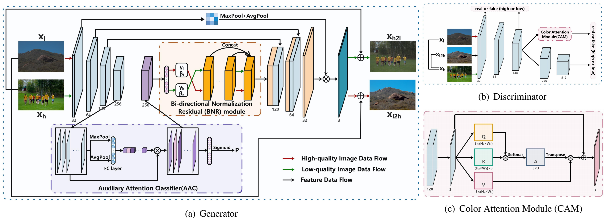

## BI-DIRECTIONAL NORMALIZATION AND COLOR ATTENTION-GUIDED GENERATIVE ADVERSARIAL NETWORK FOR IMAGE ENHANCEMENT

#### 2022 IEEE International Conference on Acoustics, Speech and Signal Processing (ICASSP)
Shan Liu, Guoqiang Xiao, Xiaohui Xu, Song Wu

College of Computer and Information Science, Southwest University, Chongqing, China

## Introdcurion

This website shares the codes of the "BI-DIRECTIONAL NORMALIZATION AND COLOR ATTENTION-GUIDED GENERATIVE ADVERSARIAL NETWORK FOR IMAGE ENHANCEMENT", 2022 IEEE International Conference on Acoustics, Speech and Signal Processing (ICASSP). 

### Abstract

Most existing image enhancement methods require paired images for supervised learning, and rarely considering the aesthetic quality. This paper proposes a bi-directional normalization and color attention-guided generative adversarial network (BNCAGAN) for unsupervised image enhancement. An auxiliary attention classifier (AAC) and a bi-directional normalization residual (BNR) module are designed to assist the generator in flexibly controlling the local details with the constraint from both the low/high-quality domain. Moreover, a color attention module (CAM) is proposed to preserve the color fidelity in the discriminator. The qualitative and quantitative experimental results demonstrated that our BNCAGAN is superior to the existing methods on image enhancement. It can effectively improve the authenticity and naturalness of the enhanced images. The source code is available at https://github.com/SWU-CS-MediaLab/BNCAGAN.

<!-- **The framework of BNCAGAN:** -->



## Requirements and Installation
We recommended the following dependencies.
*  Python 3.7
*  PyTorch 1.7.1
*  tqdm 4.42.1
*  munch 2.5.0
*  torchvision 0.8.2

## Training
Prepare the training, testing, and validation data. The folder structure should be:
```
data
└─── fiveK
	├─── train
	|	├─── exp
	|	|	├──── a1.png                  
	|	|	└──── ......
	|	└─── raw
	|		├──── b1.png                  
	|		└──── ......
	├─── val
	|	├─── label
	|	|	├──── c1.png                  
	|	|	└──── ......
	|	└─── raw
	|		├──── c1.png                  
	|		└──── ......
	└─── test
		├─── label
		| 	├──── d1.png                  
		| 	└──── ......
		└─── raw
			├──── d1.png                  
			└──── ......
```
```raw/```contains low-quality images, ```exp/``` contains unpaired high-quality images, and ```label/``` contains corresponding ground truth.

To train BNCAGAN on FiveK, run the training script below.
```
python main.py --mode train --version BNCAGAN-FiveK --use_tensorboard False \
--is_test_nima True --is_test_psnr_ssim True
```

To test BNCAGAN on FiveK, run the test script below.
```
python main.py --mode test --version BNCAGAN-FiveK --pretrained_model xx (best epoch, e.g., 100) \
--is_test_nima True --is_test_psnr_ssim True

```

## Citation

If this code/BNCAGAN is useful for your research, please cite our paper:

## Contact

swu1538@email.swu.edu.cn

## Acknowledgments

Our code is developed based on [UEGAN](https://github.com/eezkni/UEGAN) and [UGATIT-pytorch](https://github.com/znxlwm/UGATIT-pytorch). We thank the awesome work provided by UEGAN and UGATIT.
Great thanks to the reviewers from the ICASSP conference for their invaluable feedbacks and suggestions.


